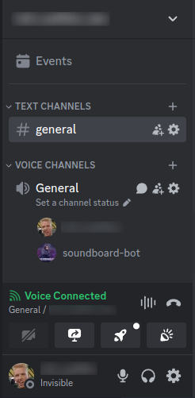
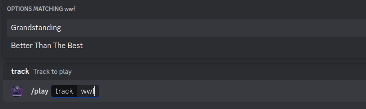
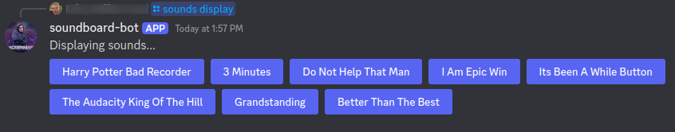

# discord-soundboard-bot
A simple, unlimited audio track soundboard for discord, proxied via bot in voice channel.

## Overview

The `discord-soundboard-bot` allows users in a voice channel to play an unlimited length, unlimited number of audio tracks.

<center>
  <table border="0">
    <tr valign="center">
      <td>
        <h5 style="text-align:center">Voice Channel</h5>
        </td>
      <td >
        <table border="0">
          <tr>
            <td>
              <h5><code>/play {track}</code></h5>
              
            </td>
          </tr>
          <tr>
            <td>
              <h5><code>/sounds display</code></h5>
              
            </td>
          </tr>
        </table>
      </td>
    </tr>
  </table>
</center>


The simple steps to using the soundboard-bot are as follows...

- User joins a voice channel
- Command the soundboard-bot to join the voice channel with the `sb:join` command
- Play desired sound using the `/play {track name}`

**OR**

-  Use the sound buttons in a text channel `/sounds display`

**Note** The soundboard-bot commands are typed in any text channel on the server.


## Dependencies
- [Songbird Dependencies](https://github.com/serenity-rs/songbird/tree/current#dependencies)
- [A Registered Discord Bot](https://discord.com/developers/docs/quick-start/getting-started)

## Slash Commands
- `/play {track}` - Play sound track in voice channel
- `/sounds`
  - `/sounds add` - Opens form to add sounds
  - `/sounds remove {track}` - Removes sound
  - `/sounds edit {track}` - Opens form to edit sound track
  - `/sounds display` - Displays a button grid of sounds that can be played in voice channel
  - `/sounds join-audio {track}` - Set/Unset sound track to play when bot joins voice channel
  - `/sounds leave-audio {track}` - Set/Unset sound track to play when bot leaves voice channel

## Prefix Commands
- `{prefix}:join` - Have bot join the voice channel
- `{prefix}:leave` - Have bot leave the voice channel
- `{prefix}:register` - Register/UnRegister slash commands for guild or globally
- `{prefix}:scan` - Scan local audio directory and add sound tracks not in database

## RasperryPI Setup

It is suggested to build with the `sqlite3-bundled` feature to avoid dependency and extension headaches.

```bash
cargo build --release -F sqlite3-bundled
```

## Environment variables
- `DISCORD_BOT_TOKEN` - The discord token. Available on the discord developer portal website.
- `DISCORD_BOT_APPLICATION_ID` - Bot application ID. Available on the discord developer portal website.
- `DISCORD_BOT_AUDIO_DIR` - **default**: `./audio` - The directory containing `.mp3` files to play.
- `DISCORD_BOT_COMMAND_PREFIX` - **default**: `sb:` - The command prefix when communicating to the bot from a discord text channel.
- `DISCORD_BOT_DOTENV_FILE` - **default**: `.env` - The dotenv file to load when launching the application
- `DISCORD_BOT_SQLITE_DB_FILE` - **default**: `./bot.db3` - Path to create/use SQLite3 database file.
- `DISCORD_BOT_MAX_AUDIO_FILE_DURATION` - **default**: `7000` - Maximum allowed length of an audio track in milliseconds.
- `RUST_LOG` - Set log level for application (or speicific modules) in the application
  - Examples
    - `RUST_LOG=error`
      - Set log leve `error` for entire application
    - `RUST_LOG=soundboard_bot=info,serenity=error`
      - Set log level `info` for soundboard_bot, and `error` for serenity (crate)
